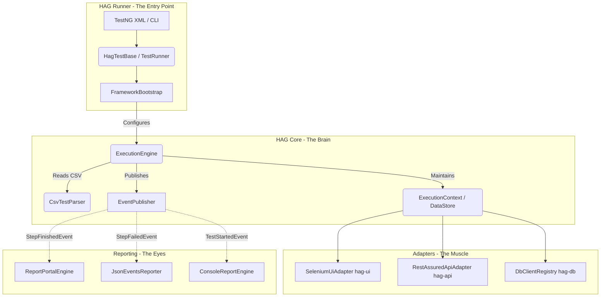

# 1. The Big Picture

H-A-G relies on a strict separation of concerns to allow parallel execution, multi-layer testing, and seamless reporting.

## High-Level Architecture

## Key Invariants (Non-Negotiables)

1. **The Engine is Stateless:** `DefaultExecutionEngine` does NOT hold test data. It receives an `ExecutionContext` injected by the thread.
2. **One `ExecutionContext` per Thread:** Parallel execution works because each thread holds its own `ExecutionContext` via a `ThreadLocal` in `HagTestBase`.
3. **Actions Must Return `ExecutionResult`:** An Action should never throw an exception to signify failure. It must trap errors and return `ExecutionResult.failure("reason")`. Exceptions are reserved for catastrophic runner failures (e.g. out of memory, misconfigurations).
4. **All Variables Resolve via Interpolator:** Do not manually parse `${var}` strings inside your Action logic. Call `ValueInterpolator.interpolate(...)` to handle DataStore, JSON caching, and DataGenerator dynamically.

## Mental Models

- **The Engine as a Conductor:** Think of `ExecutionEngine` as an orchestra conductor. It doesn't know how to play the violin (Selenium) or the trumpet (JDBC). It simply reads the sheet music (CSV file) and points its baton at the correct musician (Action).
- **The CSV as a Function Call:** Every row in a CSV is literally an invocation of `Action.execute()`. 
  - `Action` column = The specific class to route to.
  - `Target` column = Argument 1 (Recipient/Element).
  - `Value` column = Argument 2 (Source/Input).
  - `Key` column = Argument 3 (Storage alias).
