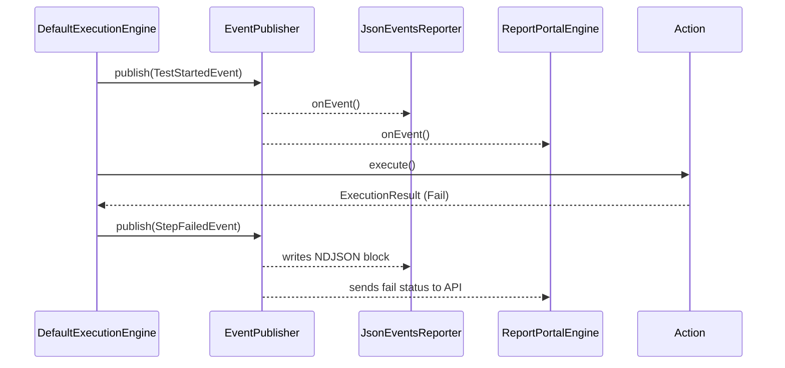

# 3. Core Execution Engine

The `hag-core` module houses the `DefaultExecutionEngine`. This is the beating heart of H-A-G. 

## The Execution Flow

1. **Resolution:** A test suite triggers `engine.execute("My Test", "path/to/file.csv", context)`.
2. **Parsing:** The `CsvTestParser` streams the file into memory as `Step` objects.
3. **The Step Loop:** The engine iterates through the Steps.
4. **Action Lookup:** It uses `ActionRegistry` to map the string "INPUT" to the `InputAction` class.
5. **Interpolation:** The engine calls `ValueInterpolator` to resolve variables in the `Recipient`, `Source`, and `Key` columns before handing them to the Action.
6. **Execution:** It calls `Action.execute()`.
7. **Result Evaluation:** The Action returns an `ExecutionResult` (Success, Failure, Skipped).
8. **Event Broadcasting:** The engine publishes a `StepFinishedEvent` or `StepFailedEvent`.

## CsvTestParser
H-A-G uses `OpenCSV` for high-performance reading. 
- **Directives:** The parser supports "Preamble Directives" (lines starting with `#!`). These are parsed before the header row is found, used for setting metadata or retry policies for the script.
- **Skipping:** Empty lines, lines starting with `#` (comments), and non-standard lines are skipped safely.

## The Event Publisher Architecture
H-A-G has a decoupled reporting mechanism using an Observer Pattern.

> [!CAUTION]
> Reporting Engines are singletons created during Suite Bootstrap. When handling events, they must be thread-safe. If your reporter needs to track state (like what test is currently running), you MUST use a `ThreadLocal` map, or the event streams from parallel test executions will collide.
