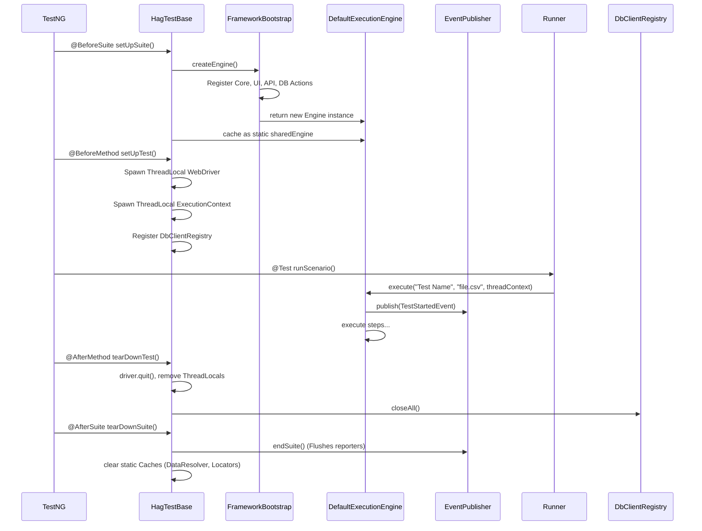

# 6. Test Lifecycle & Pipelines

The runner execution relies heavily on TestNG's parallel execution features and lifecycle annotations. The main entry point for running a test is the `HagTestBase` class, which is inherited by suite runners (like `TestRunner.java`).

## The Suite Lifecycle

## Bootstrap Phase
The `FrameworkBootstrap` class is critical. When the JVM starts the suite, the Bootstrap class explicitly creates the `ActionRegistry` and calls `.register("CLICK", new ClickAction())` for every action in the framework.

> [!IMPORTANT]
> H-A-G purposely avoids Spring Boot or reflection-based classpath scanning (like Java Reflections API) to register actions. This was an architectural decision to keep startup times under 200ms and avoid "magic" behavior. You must manually register new actions in Bootstrap.
